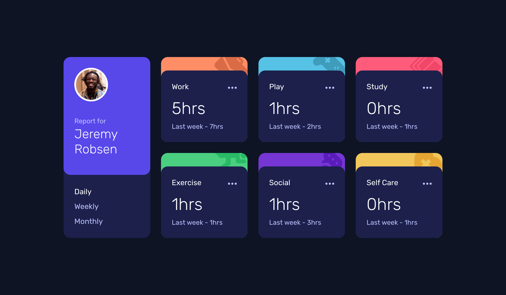

# FM - Time tracking dashboard



[=> Live Preview on Vercel](https://fm-time-tracking-dashboard-pr5pnutpw-zwickermann.vercel.app/)

## Moin! 👋

Thanks for checking out my implementation of this coding challenge. Feel free to add as many comments as you like - especially when it comes to React and TypeScript improvements!! ❤

I used React (Next), TypeScript, and SASS (+ custom properties + grid).

## The challenge

[=> Time tracking dashboard challenge on Frontend Mentor](https://www.frontendmentor.io/challenges/time-tracking-dashboard-UIQ7167Jw)

This challenge is to build out a dashboard and get it looking as close to the design as possible.

The users should be able to:

- View the optimal layout for the site depending on their device's screen size
- See hover states for all interactive elements on the page
- Switch between viewing Daily, Weekly, and Monthly stats

## Run project
```
npm run dev
```

## Notes 
```
npx create-next-app@latest
npm install sass
npm run dev
```